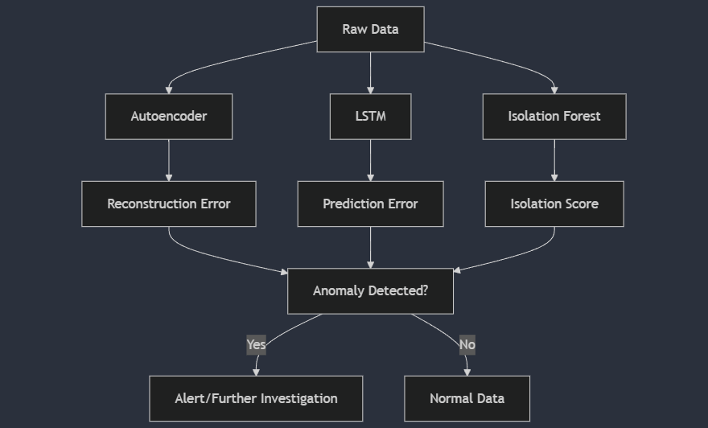

# Autoencoder Anomaly Detection

This project demonstrates how to use an autoencoder neural network for anomaly detection on synthetic data. The autoencoder is built using TensorFlow and Keras, and the data is preprocessed using scikit-learn.

## Project Structure

- `autoencoder_anomaly_detection.py`: Main script that generates synthetic data, preprocesses it, builds and trains the autoencoder model, and evaluates its performance.

## Requirements

- Python 3.x
- NumPy
- TensorFlow
- scikit-learn

You can install the required packages using pip:

```sh
pip install numpy tensorflow scikit-learn
```

## Usage

Run the autoencoder_anomaly_detection.py script to execute the anomaly detection process:

```sh
python autoencoder_anomaly_detection.py
```

## Explanation

### Data Generation

- Synthetic normal data and anomalies are generated using NumPy.
- The data is combined and split into training and testing sets.

### Data Preprocessing

- The data is normalized using `StandardScaler` from scikit-learn.

### Model Building

- An autoencoder model is built using Keras with a single hidden layer for encoding and decoding.

### Model Training

- The autoencoder is trained on the training data.

### Anomaly Detection

- The model predicts on the test data, and the mean squared error (MSE) is calculated.
- A threshold is set for anomaly detection based on the 95th percentile of the MSE.
- Anomalies are detected based on whether the MSE exceeds the threshold.

### Evaluation

The accuracy of the anomaly detection is calculated and printed.
The number of true anomalies detected and false positives are printed.

## Output

The script prints the following metrics:

```sh
Accuracy: 0.95
True anomalies detected: 95/100
False positives: 5/900
```

## Diagram



## License

This project is licensed under the MIT License.
